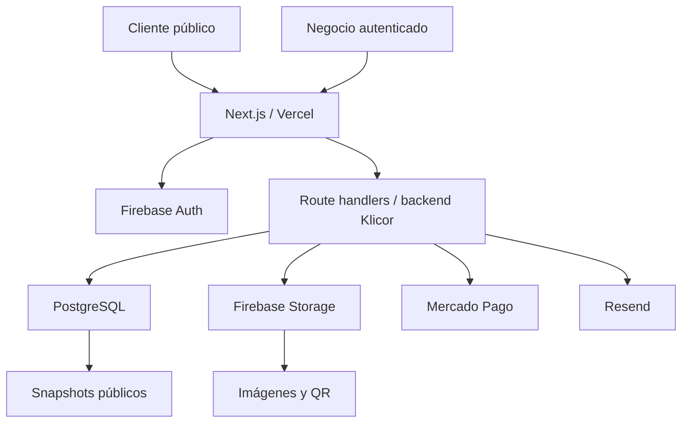

# README interno: base de datos propia para Klicor

Fecha: 2026-04-07

Este documento es una memoria técnica para retomar, cuando convenga, la salida gradual de Firestore hacia una base de datos propia. No es una tarea activa de implementación. La idea es que Codex y el equipo puedan volver aquí y tener claro qué mover, qué conservar y en qué orden hacerlo sin rehacer el análisis.

## Resumen ejecutivo

Klicor hoy está bien armado para moverse rápido: Next.js en Vercel, Firebase Auth, Firestore, Firebase Storage, Mercado Pago y Resend. Esa combinación permite construir sin montar infraestructura pesada.

El riesgo aparece cuando crece el uso público: perfiles, tiendas, menús, catálogos, productos, pedidos y analytics pueden generar muchas lecturas y escrituras en Firestore. Firestore cobra por documentos e índices leídos para resolver consultas, por escrituras, por deletes, por storage y por ancho de banda. Eso hace que el costo escale con cada visita y cada interacción.

La recomendación no es sacar Firebase de golpe. La ruta sana es híbrida:

1. Mantener Firebase Auth para login y validación de usuarios.
2. Mantener Firebase Storage para imágenes, QR y assets subidos por negocios.
3. Crear PostgreSQL como base principal futura para datos comerciales y operativos.
4. Migrar primero lo que más se lee y más costo puede generar: tienda, menú, catálogo, productos, pedidos, snapshots públicos y analytics.
5. Dejar Firestore como sistema legado durante la transición, con dual-write y backfill controlado.

La meta es que Klicor pase de pagar por muchas lecturas de documentos a operar sobre consultas SQL, índices propios y snapshots públicos más predecibles.

## Estado actual del sistema

Stack detectado en el repo:

- Next.js App Router, React 19 y despliegue en Vercel.
- Firebase Client SDK para autenticación del usuario en frontend.
- Firebase Admin SDK en backend para Auth, Firestore y Storage.
- Firestore como base principal de usuarios, perfil público, pagos, analytics, settings, panel admin y módulo comercial.
- Firebase Storage para imágenes de perfil, QR de pago, QR permanente y productos comerciales.
- Mercado Pago para checkout anual y webhook de pagos.
- Resend para correos transaccionales.
- `next/cache` con `unstable_cache` y `revalidateTag` para cache público.
- Cron de Vercel en `/api/billing/cron`.

Archivos clave:

- `lib/firebase-admin.js`: inicializa Auth, Firestore y Storage en backend.
- `lib/firebase-client.js`: inicializa Firebase Auth, Firestore y Storage en cliente.
- `lib/firestore.js`: usuarios, perfiles, usernames, publicLinks, billing, pagos y analytics.
- `lib/commerce-firestore.js`: categorías, subcategorías, productos, imágenes y snapshots públicos comerciales.
- `lib/public-commerce.js`: cache público de tienda, menú y catálogo.
- `lib/public-profiles.js`: cache público de perfiles.
- `lib/admin-panel.js`: panel interno, métricas, usuarios, logs y pagos manuales.
- `app/api/commerce/route.js`: acciones administrativas del módulo comercial.
- `app/api/public/commerce/[username]/route.js`: carga pública por categoría o subcategoría.
- `firestore.rules`, `storage.rules` y `firestore.indexes.json`: reglas e índices actuales.

Colecciones actuales principales:

- `users`
- `usernames`
- `publicLinks`
- `settings`
- `payments`
- `analytics`
- `partners`
- `adminLogs`
- `users/{uid}/commerceCategories`
- `users/{uid}/commerceSubcategories`
- `users/{uid}/commerceProducts`
- `users/{uid}/commercePublicSections`

## Riesgos de costo actuales

### 1. Vista pública comercial

La vista pública de tienda, menú y catálogo es el flujo con mayor potencial de crecimiento. Un negocio puede compartir su link y recibir muchas visitas de clientes que no pagan a Klicor, pero sí generan costo.

Ya existe una mejora importante: `commercePublicSections` permite servir snapshots por sección, de modo que la navegación principal puede leer un documento de snapshot en vez de consultar hasta 24 productos por cada sección. Esto reduce lecturas y hace más fluida la experiencia.

Riesgo restante:

- Cada categoría o subcategoría sigue dependiendo de Firestore como backend de lectura.
- Los snapshots se regeneran en cambios administrativos y siguen siendo documentos de Firestore.
- El tráfico público puede crecer mucho más que el tráfico administrativo.

### 2. Analytics de clicks

`trackClick()` escribe en `analytics/{slug}_{button}` con incrementos. Es simple, pero puede volverse un punto caliente si un perfil o botón recibe muchas visitas.

Mejor alternativa futura:

- Registrar eventos en una tabla de eventos o cola liviana.
- Consolidar métricas por día, negocio, link y tipo de evento.
- Evitar escribir siempre sobre el mismo documento caliente.

### 3. Panel admin

`getAdminPanelSnapshot()` carga usuarios y arma métricas desde Firestore. Funciona para volúmenes pequeños, pero cuando Klicor tenga muchos negocios conviene que el panel use consultas paginadas, agregados SQL o tablas de resumen.

### 4. Cron de billing

`/api/billing/cron` consulta usuarios con estados activos, trial, grace y suspended. En una base propia se puede resolver con índices por estado y fecha de vencimiento, leyendo solo lo que realmente vence o necesita correo.

### 5. Imágenes

Firebase Storage es razonable para imágenes, pero el costo puede crecer por storage, operaciones y transferencia de red. No conviene mover binarios a PostgreSQL. Primero se debe optimizar tamaño, caching y CDN. Solo después tendría sentido evaluar R2, S3 o Cloudflare Images.

## Qué mantener en Firebase por ahora

### Firebase Auth

Mantenerlo inicialmente. Ya resuelve Google, Microsoft, email link, tokens y claims de admin. Mover Auth antes de mover datos complicaría la migración sin resolver el principal problema de costo.

Diseño recomendado:

- El usuario sigue iniciando sesión con Firebase Auth.
- El backend verifica el ID token con Firebase Admin.
- La base propia guarda una tabla `accounts` con `firebase_uid` como identificador externo.
- Las API usan `firebase_uid -> account_id` para leer y escribir en PostgreSQL.

### Firebase Storage

Mantenerlo inicialmente para:

- Fotos de negocio.
- QR permanente.
- QR de pago.
- Imágenes de productos.

Regla:

- No guardar imágenes binarias en PostgreSQL.
- Guardar en PostgreSQL solo URL, path, dimensiones, hash y metadata.
- Optimizar imágenes antes de subirlas, como ya hace `sharp` en productos.

### Firebase Admin SDK

Mantenerlo durante la transición para:

- Verificar tokens.
- Leer datos legados.
- Ejecutar backfills desde Firestore.
- Hacer dual-write mientras no se haya terminado la migración.

## Qué mover a base de datos propia

Mover primero los datos que son operativos, consultables y con relaciones claras:

- Negocios y perfil principal.
- Usernames y public links.
- Configuración visual y temas.
- Módulo comercial: categorías, subcategorías, productos y snapshots públicos.
- Pedidos y detalle de pedidos.
- Clientes del negocio, si se formaliza CRM ligero.
- Pagos, suscripciones y estados de cuenta.
- Settings administrativos.
- Analytics y métricas agregadas.
- Logs administrativos.

No mover primero:

- Auth.
- Storage de imágenes.
- Integración con Mercado Pago.
- Envío por Resend.

## Base de datos objetivo

Recomendación: PostgreSQL.

Motivos:

- Modelo relacional natural para negocios, productos, categorías, pedidos y pagos.
- Índices compuestos más controlables.
- Transacciones fuertes.
- Agregados y reportes más fáciles que en Firestore.
- Costos más predecibles cuando la carga crece.
- Permite snapshots JSONB para lectura pública rápida sin perder estructura relacional.

Puede empezar como base administrada, por ejemplo Cloud SQL para PostgreSQL, Neon, Supabase, Railway, Render, RDS u otra opción administrada. "Base propia" no tiene que significar mantener un servidor manual desde el día uno. Lo importante es que el modelo de datos y las consultas sean nuestras, con migraciones versionadas y salida clara de Firestore para las rutas calientes.

## Modelo propuesto

Nombres tentativos. Ajustar cuando se implemente.

```sql
accounts (
  id uuid primary key,
  firebase_uid text unique not null,
  email text not null,
  role text not null,
  plan text not null,
  status text not null,
  account_status text not null,
  created_at timestamptz not null,
  updated_at timestamptz not null
);

businesses (
  id uuid primary key,
  account_id uuid not null references accounts(id),
  username text unique,
  username_lower text unique,
  public_link_id text unique,
  business_name text not null,
  business_category text,
  business_headline text,
  business_subheadline text,
  photo_url text,
  theme jsonb not null default '{}',
  custom_themes jsonb not null default '[]',
  contact_card jsonb not null default '{}',
  billing_profile jsonb not null default '{}',
  created_at timestamptz not null,
  updated_at timestamptz not null
);

profile_links (
  id uuid primary key,
  business_id uuid not null references businesses(id),
  type text not null,
  label text,
  value text,
  url text,
  order_index integer not null default 0,
  visible boolean not null default true,
  created_at timestamptz not null,
  updated_at timestamptz not null
);

payment_methods (
  id uuid primary key,
  business_id uuid not null references businesses(id),
  type text not null,
  label text,
  value text,
  qr_image_url text,
  qr_path text,
  order_index integer not null default 0,
  visible boolean not null default true,
  created_at timestamptz not null,
  updated_at timestamptz not null
);

commerce_configs (
  business_id uuid primary key references businesses(id),
  active_mode text,
  order_whatsapp text,
  currency text not null default 'COP',
  categories_count integer not null default 0,
  subcategories_count integer not null default 0,
  products_count integer not null default 0,
  visible_products_count integer not null default 0,
  has_content boolean not null default false,
  updated_at timestamptz not null
);

commerce_categories (
  id uuid primary key,
  business_id uuid not null references businesses(id),
  mode text not null,
  name text not null,
  slug text not null,
  order_index integer not null,
  has_subcategories boolean not null default false,
  first_subcategory_id uuid,
  product_count integer not null default 0,
  visible_product_count integer not null default 0,
  subcategory_count integer not null default 0,
  created_at timestamptz not null,
  updated_at timestamptz not null
);

commerce_subcategories (
  id uuid primary key,
  business_id uuid not null references businesses(id),
  category_id uuid not null references commerce_categories(id),
  name text not null,
  slug text not null,
  order_index integer not null,
  product_count integer not null default 0,
  visible_product_count integer not null default 0,
  created_at timestamptz not null,
  updated_at timestamptz not null
);

commerce_products (
  id uuid primary key,
  business_id uuid not null references businesses(id),
  category_id uuid not null references commerce_categories(id),
  subcategory_id uuid references commerce_subcategories(id),
  mode text not null,
  name text not null,
  description text,
  price integer,
  visible boolean not null default true,
  order_index integer not null,
  image_url text not null,
  image_thumb_url text not null,
  image_path text,
  image_thumb_path text,
  image_width integer,
  image_height integer,
  created_at timestamptz not null,
  updated_at timestamptz not null
);

public_commerce_sections (
  id uuid primary key,
  business_id uuid not null references businesses(id),
  mode text not null,
  section_type text not null,
  category_id uuid references commerce_categories(id),
  subcategory_id uuid references commerce_subcategories(id),
  page_size integer not null,
  products jsonb not null default '[]',
  subcategories jsonb not null default '[]',
  has_more boolean not null default false,
  next_cursor integer,
  updated_at timestamptz not null
);

orders (
  id uuid primary key,
  business_id uuid not null references businesses(id),
  customer_name text,
  customer_phone text,
  customer_address text,
  notes text,
  status text not null,
  currency text not null default 'COP',
  subtotal integer not null default 0,
  total integer not null default 0,
  whatsapp_message text,
  created_at timestamptz not null,
  updated_at timestamptz not null
);

order_items (
  id uuid primary key,
  order_id uuid not null references orders(id),
  product_id uuid references commerce_products(id),
  product_name text not null,
  unit_price integer,
  quantity integer not null,
  total integer not null
);

payments (
  id text primary key,
  account_id uuid references accounts(id),
  amount integer,
  status text,
  status_detail text,
  method text,
  external_reference text,
  raw jsonb not null default '{}',
  activated_at timestamptz,
  created_at timestamptz not null,
  updated_at timestamptz not null
);

analytics_events (
  id uuid primary key,
  business_id uuid references businesses(id),
  event_type text not null,
  target_type text,
  target_id text,
  occurred_at timestamptz not null,
  metadata jsonb not null default '{}'
);

analytics_daily_rollups (
  business_id uuid not null references businesses(id),
  day date not null,
  event_type text not null,
  target_type text not null,
  target_id text not null,
  total integer not null default 0,
  primary key (business_id, day, event_type, target_type, target_id)
);
```

## Índices recomendados

```sql
create unique index businesses_username_lower_idx on businesses(username_lower) where username_lower is not null;
create unique index businesses_public_link_id_idx on businesses(public_link_id) where public_link_id is not null;

create index commerce_categories_business_order_idx
  on commerce_categories(business_id, mode, order_index);

create index commerce_subcategories_category_order_idx
  on commerce_subcategories(category_id, order_index);

create index commerce_products_category_visible_order_idx
  on commerce_products(category_id, visible, order_index);

create index commerce_products_subcategory_visible_order_idx
  on commerce_products(subcategory_id, visible, order_index);

create index public_commerce_sections_lookup_idx
  on public_commerce_sections(business_id, mode, section_type, category_id, subcategory_id);

create index orders_business_created_idx
  on orders(business_id, created_at desc);

create index accounts_status_dates_idx
  on accounts(status, account_status, updated_at);

create index analytics_events_business_time_idx
  on analytics_events(business_id, occurred_at desc);
```

## Estrategia de snapshots públicos

Mantener la idea ya implementada en Firestore, pero llevarla a PostgreSQL:

- Cada categoría directa tiene un snapshot público.
- Cada categoría con subcategorías guarda un snapshot que apunta a la primera subcategoría.
- Cada subcategoría tiene su snapshot público.
- El snapshot incluye los primeros productos visibles y los chips de subcategorías si aplica.
- La vista pública lee primero `public_commerce_sections`.
- Si hay paginación, la segunda página puede salir de `commerce_products` con cursor por `order_index`.

Ventaja:

- Una navegación típica de cliente lee una fila optimizada por sección.
- El admin puede hacer escrituras más pesadas porque ocurre con menor frecuencia.
- La tienda pública no queda atada a leer muchos productos en cada toque.

## Arquitectura objetivo



Regla de arquitectura:

- Auth identifica quién es el usuario.
- PostgreSQL decide qué datos puede operar.
- Storage guarda archivos.
- La API de Klicor es la única capa que escribe datos de negocio.

## Fases de migración

### Fase 0: medición

Antes de mover datos:

- Medir lecturas por ruta pública.
- Medir escrituras por acción admin.
- Medir tamaño promedio de producto, categoría y snapshot.
- Medir tráfico de imágenes.
- Configurar alertas de presupuesto.
- Registrar costo por tienda activa y costo por visita pública.

### Fase 1: agregar PostgreSQL sin cambiar comportamiento

- Elegir proveedor administrado.
- Agregar ORM o query builder, preferiblemente Prisma o Drizzle.
- Crear migraciones versionadas.
- Crear `lib/db` con conexión server-only.
- Crear tablas base `accounts`, `businesses` y `commerce_*`.
- No cambiar todavía la UI.

### Fase 2: mapa de identidad

- Crear `accounts.firebase_uid`.
- En cada request autenticado, verificar token con Firebase Auth.
- Resolver `firebase_uid -> account_id`.
- Si no existe, crear account shadow desde Firestore.
- Mantener Firestore como fuente real en esta fase.

### Fase 3: dual-write del módulo comercial

Cada acción en `/api/commerce` debe escribir en:

1. Firestore, para no romper producción.
2. PostgreSQL, como nueva base.

Acciones incluidas:

- Guardar configuración comercial.
- Crear, editar, eliminar y ordenar categorías.
- Crear, editar, eliminar y ordenar subcategorías.
- Crear, editar, eliminar, ordenar y ocultar productos.
- Regenerar snapshots públicos.

Si falla PostgreSQL al principio, registrar error y no bloquear al usuario. Cuando PostgreSQL se vuelva fuente primaria, invertir la regla.

### Fase 4: backfill

Crear script de migración:

- Leer `users`.
- Crear `accounts`.
- Crear `businesses`.
- Migrar `profileLinks`, `paymentMethods`, settings y billing profile.
- Migrar `commerceCategories`, `commerceSubcategories`, `commerceProducts`.
- Generar `public_commerce_sections`.
- Migrar pagos y settings admin.
- Dejar reporte de diferencias por uid.

El backfill debe ser idempotente: se puede correr más de una vez sin duplicar datos.

### Fase 5: switch de lecturas públicas

Primero mover lo más caro:

- `getPublicCommerceBootstrapByUsername`
- `getPublicCommerceChunkByUsername`
- `getPublicProfileByUsername`, si el tráfico de perfiles también crece.

Usar feature flag:

```txt
PUBLIC_COMMERCE_SOURCE=firestore | postgres | hybrid
```

En `hybrid`:

- Leer desde PostgreSQL si el negocio está migrado.
- Si no está migrado, leer desde Firestore.
- Registrar métricas de fallback.

### Fase 6: switch de lecturas admin

Mover:

- Estado del módulo comercial.
- Panel admin paginado.
- Billing y pagos.
- Analytics y reportes.

El panel admin no debe seguir leyendo todos los usuarios en memoria cuando haya volumen.

### Fase 7: PostgreSQL como fuente primaria

Cuando las lecturas públicas y admin estén estables:

- Escribir primero en PostgreSQL.
- Mantener Firestore como mirror temporal.
- Después apagar dual-write para las tablas migradas.
- Dejar Firestore solo para datos que aún no se hayan migrado.

### Fase 8: evaluación final de Firebase

Solo después de estabilizar datos:

- Evaluar si Auth sigue siendo conveniente.
- Evaluar si Storage sigue siendo conveniente.
- Evaluar si conviene mover imágenes a Cloudflare R2, S3 o Cloudflare Images.

No hacer esto antes. No resuelve el costo principal y añade riesgo operativo.

## Cambios de código esperados cuando se implemente

Nueva capa sugerida:

```txt
lib/db/client.js
lib/db/accounts.js
lib/db/businesses.js
lib/db/commerce.js
lib/db/public-commerce.js
lib/db/payments.js
lib/db/analytics.js
scripts/migrate-firestore-to-postgres.mjs
scripts/verify-postgres-migration.mjs
```

Principio:

- `lib/commerce-firestore.js` no debe crecer indefinidamente.
- Crear una interfaz de repositorio, por ejemplo `commerceRepository`, para poder alternar Firestore/PostgreSQL por feature flag.
- Evitar que los componentes React sepan si la fuente es Firestore o PostgreSQL.

## Qué no hacer

- No migrar todo en una sola entrega.
- No mover imágenes a PostgreSQL.
- No reemplazar Auth antes de migrar los datos calientes.
- No leer toda la base para construir el panel admin.
- No duplicar lógica de negocio entre Firestore y PostgreSQL sin una capa común.
- No crear una base propia sin backups, migraciones y monitoreo.

## Controles de costo recomendados desde ya

- Mantener snapshots públicos del comercio.
- Mantener paginación por cursor, no por offset.
- Evitar listeners en tiempo real en vistas públicas.
- Limitar prefetch a pocas secciones.
- Optimizar imágenes y servir thumbs en listados.
- Agregar cache de servidor y, cuando sea necesario, cache tipo Redis/KV para snapshots públicos.
- Agregar budget alerts en Google Cloud.
- Medir costo por visita pública y costo por negocio activo.

## Señales para iniciar esta migración

Empezar cuando ocurra cualquiera de estas señales:

- La vista pública comercial concentra la mayoría de lecturas de Firestore.
- El costo mensual de Firestore crece más rápido que el ingreso por negocios activos.
- El panel admin se vuelve lento por leer demasiados usuarios.
- Analytics empieza a escribir demasiado sobre documentos calientes.
- Se necesita reportería por negocio, producto, pedido o periodo.
- Se necesita historial real de pedidos dentro de Klicor.

## Decisión recomendada

Cuando se retome:

1. No tocar Auth ni Storage al inicio.
2. Crear PostgreSQL y migraciones.
3. Migrar primero módulo comercial y snapshots públicos.
4. Luego pedidos y analytics.
5. Luego panel admin, billing y reportes.
6. Dejar Firebase como apoyo hasta que el costo o la complejidad justifique reemplazar más piezas.

Este camino reduce el riesgo porque conserva lo que ya funciona, pero mueve la parte que más puede encarecerse cuando Klicor crezca.

## Fuentes oficiales revisadas

- [Firestore billing](https://firebase.google.com/docs/firestore/pricing): Firestore cobra documentos e índices leídos, escrituras, deletes, storage y ancho de banda. También confirma el costo mínimo por consulta y el impacto de offsets.
- [Firestore best practices](https://firebase.google.com/docs/firestore/best-practices): recomienda migraciones graduales, paralelización controlada, batch jobs y dual-write si se necesita rollback.
- [Cloud SQL pricing](https://cloud.google.com/sql/pricing): Cloud SQL para PostgreSQL cobra por CPU/memoria, storage, networking e instancia.
- [Cloud Storage pricing](https://cloud.google.com/storage/pricing): Cloud Storage cobra por almacenamiento, procesamiento/operaciones y uso de red.
- [Identity Platform pricing](https://cloud.google.com/identity-platform/pricing): Auth/Identity Platform se entiende por usuarios activos mensuales en la mayoría de métodos y por SMS en phone/MFA.
- [Firebase Hosting usage and pricing](https://firebase.google.com/docs/hosting/usage-quotas-pricing): hosting se mide por storage y transferencia; útil si Klicor decide usar Firebase Hosting para alguna pieza.
